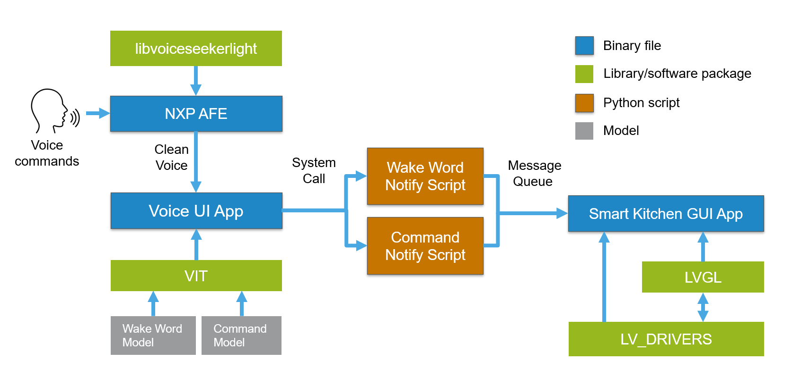

# Smart Kitchen demo for i.MX

This application uses a VIT command interface and an LVGL GUI to emulate a smart kitchen controlled by voice commands. 

## Software Architecture Overview

The diagram below shows a general overview of the Smart Kitchen software components.




## Build instructions

### Clone this repo:

```bash
git clone ssh://git@bitbucket.sw.nxp.com/mag/smart-kitchen.git
```

### Update modules:

```bash
cd smart-kitchen/
git submodule update --init --recursive
```

### Set the environment

This example is using linux 5.15-kirkstone for i.MX8M Mini
```bash
source /opt/fsl-imx-internal-xwayland/5.15-kirkstone/environment-setup-cortexa53-crypto-poky-linux
```


### Build

Inside smart-kitchen demo execute make
```bash
cd smart-kitchen/
make
```

Then move to vit directory and execute make
```bash
cd smart-kitchen/imxvoiceui/vit/i.MX8M_A53/
make
```

### Download binary files to board

copy next files to board:

- `smart-kitchen/imxvoiceui/vit/i.MX8M_A53/build/vit_demo`
- `smart-kitchen/demo`
- `smart-kitchen/run.sh`

## How to run

Once the files are copied, simply make sure the three files are all in the same location, and execute run.sh file:

```bash
./run.sh
```

## Usage

The VIT voice command interface works as follows: You must say a wakeword first to select the Kitchen item you want to control,then you can say the item command you want to execute. To perform any other command you must say the corresponding wakeword first. The list of supported wakewords and commands are:

### Wake words supported:

- HEY HOOD
- HEY OVEN
- HEY AIRCON

### Voice Commands supported:

General commands (work with any wakeword)

- ENTER
- EXIT
- RUN DEMO
- STOP DEMO

Hood commands

- FAN OFF
- FAN ON
- FAN LOW
- FAN HIGH
- LIGHT OFF
- LIGHT ON

Aircon commands

- FAN OFF
- FAN ON
- FAN LOW
- FAN HIGH
- DRY MODE
- COOL MODE
- FAN MODE
- SWING OFF
- SWING ON

Oven commands

- CLOSE DOOR
- OPEN DOOR

There are more commands the app can perform that are not supported with voice yet, but can be executed by clicking on the GUI controls using a mouse or the touchscreen if available.
