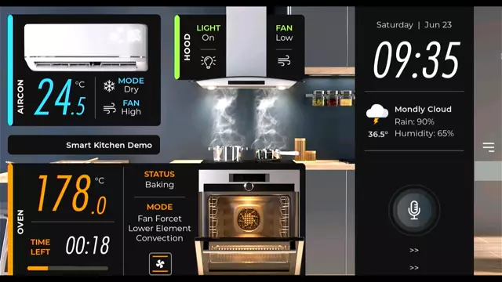

# i.MX Smart Kitchen

<!----- Boards ----->
[](./LICENSE.txt) [](https://www.nxp.com/products/processors-and-microcontrollers/arm-processors/i-mx-applications-processors/i-mx-8-applications-processors/i-mx-8m-plus-arm-cortex-a53-machine-learning-vision-multimedia-and-industrial-iot:IMX8MPLUS)
[](https://www.nxp.com/products/processors-and-microcontrollers/arm-processors/i-mx-applications-processors/i-mx-8-applications-processors/i-mx-8m-mini-arm-cortex-a53-cortex-m4-audio-voice-video:i.MX8MMINI) [](https://www.nxp.com/products/processors-and-microcontrollers/arm-processors/i-mx-applications-processors/i-mx-9-processors/i-mx-93-applications-processor-family-arm-cortex-a55-ml-acceleration-power-efficient-mpu:i.MX93)
 

[*i.MX Smart Kitchen*](https://github.com/nxp-imx-support/smart-kitchen) showcases the *Multimedia* capabilities of i.MX to emulate an interactive kitchen through a GUI controlled by voice commands. The GUI is
based on LVGL ([Little Versatile Graphic Library](https://lvgl.io/)) and NXP's [Voice Intelligent Technology](https://www.nxp.com/design/design-center/software/embedded-software/voice-intelligent-technology-wake-word-and-voice-command-engines:VOICE-INTELLIGENT-TECHNOLOGY) (VIT) supports the voice commands.

## Implementation using VIT and LVGL

>**NOTE:** This block diagram is simplified and do not represent the complete Smart Kitchen implementation. Some elements
were omitted and only the key elements are shown.

User gives voice commands to the EVK through Wake Words and pre-defined commands. The NXP AFE module filters the voice sound and sends it to the Voice UI application module which makes the system call to the Python script. This Python application detects the Wake Word and commands provided and allocates them in the Message Queue to be attended by the Smart Kitchen GUI application, finally showing the corresponding animation.


### NXP AFE

* The audio front-end (AFE) is used as a feed for VIT voice recognition.
* It helps to clean noise and echo by using
the source and a reference of the speaker.
* With NXP AFE is possible to have a clear single channel microphone audio that
can be used for processing.

### Voice UI App

* This application uses the model to detect
wakewords and commands.
* This binary file makes possible the connection of the Wake Word Model and Command Model created on VIT with the Python scripts WakeWordNotify or WWCommandNotify to detect and diferenciate the system triggers.

### Smart Kitchen GUI App

* The graphic user interface (GUI) allows the user to see a graphic representation of the kitchen that gets the Wake Words and the Commands.
* Shows the kitchen animations corresponding the Wake Words and Commands given by the user.
* To create a high-quality display it uses the LVGL graphics library.

## Usage

The VIT voice command interface works as follows: You must say a wakeword first to select the Kitchen item you want to control, then you can say the item command you want to execute. To perform any other command you must say the corresponding wakeword first. The list of supported wakewords and commands are:

### Wake words supported

* HEY HOOD
* HEY OVEN
* HEY AIRCON

### Voice Commands supported

General commands (work with any wakeword)

* ENTER
* EXIT
* RUN DEMO
* STOP DEMO

Hood commands

* FAN OFF
* FAN ON
* FAN LOW
* FAN HIGH
* LIGHT OFF
* LIGHT ON

Aircon commands

* FAN LOW
* FAN HIGH
* DRY MODE
* COOL MODE
* FAN MODE
* SWING OFF
* SWING ON

Oven commands

* CLOSE DOOR
* OPEN DOOR

>**NOTE:** There are more commands the app can perform that are not supported with voice yet, but can be executed by clicking on the GUI controls using a mouse or the touchscreen if available.

## Table of Contents

1. [Software](#1-software)
2. [Hardware](#2-hardware)
3. [Build](#3-setup)
4. [Results](#4-results)
5. [FAQs](#5-faqs)
6. [Support](#6-support)
7. [Release Notes](#7-release-notes)

## 1 Software

*i.MX Smart Kitchen* is part of Linux BSP available at [Embedded Linux for i.MX Applications Processors](https://www.nxp.com/design/design-center/software/embedded-software/i-mx-software/embedded-linux-for-i-mx-applications-processors:IMXLINUX). All the required software and dependencies to run this
application are already included in the BSP.

i.MX Board          | Main Software Components
---                 | ---
**i.MX 8M Plus EVK** | LVGL + VIT + AFE
**i.MX 8M Mini EVK** | LVGL + VIT + AFE
**i.MX 93 EVK**      | LVGL + VIT + AFE

>**NOTE:** If you are building the BSP using Yocto Project instead of downloading the pre-built BSP, make sure
the BSP is built for *imx-image-full*, otherwise GoPoint is not included. The Smart Kitchen software is only
available in *imx-image-full*.

## 2 Hardware

To test *i.MX Smart Kitchen*, either the i.MX 8M Plus, i.MX 8M Mini or i.MX 93 EVKs are required with their respective hardware components.

Component                                         | i.MX 8M Plus       | i.MX 8M Mini       | i.MX 93
---                                               | :---:              | :---:              | :---:
Power Supply                                      | :white_check_mark: | :white_check_mark: | :white_check_mark:
HDMI Display                                      | :white_check_mark: | :white_check_mark: | :white_check_mark:
USB micro-B cable (Type-A male to Micro-B male)   | :white_check_mark: | :white_check_mark: |
USB Type-C cable  (Type-A male to Type-C male)    |                    |                    | :white_check_mark:
HDMI cable                                        | :white_check_mark: | :white_check_mark: | :white_check_mark:
IMX-MIPI-HDMI (MIPI-DSI to HDMI adapter)          | :white_check_mark: | :white_check_mark: | :white_check_mark:
Mouse                                             | :white_check_mark: | :white_check_mark: | :white_check_mark:
External microphones (8MIC-RPI-MX8)               | :white_check_mark: | :white_check_mark: |

## 3 Build

Inside smart-kitchen demo execute make

```bash
cd smart-kitchen/
make
```

Then move to VIT directory and execute make

```bash
cd smart-kitchen/imxvoiceui/vit/i.MX8M_A53/
make
```

### Download binary files to board

Copy next files to board:

- `smart-kitchen/imxvoiceui/vit/i.MX8M_A53/build/vit_demo`
- `smart-kitchen/demo`
- `smart-kitchen/run.sh`

### How to run

Once the files are copied, simply make sure the three files are all in the same location, and execute run.sh file:

```bash
./run.sh
```

## 4 Results

When *i.MX Smart Kitchen* starts running the following is seen on display:

1. An animated kitchen showing information regarding the state of the items that the user can control: Aircon, oven and hood.
2. When saying a wake word, it's corresponding item will be triggered to attend a command.

### Common commands

1. Enter: Zooms to the corresponding item to see the animations performed by other commands with more details.
2. Exit: Zooms out of the item, returning to the initial view.
3. Stop demo: Kills the GUI but keeps the VIT running in the background, therefore, it can be used to pause the demo for some time.
4. Run demo: The GUI can be launched again using this command.

### Hood commands

1. Fan off: Turns off the hood fan, with this action the user can see all the vapor commig out of the pots.
2. Fan on: Turns on the hood fan on low mode, with this action the user can see a little vapor commig out of the pots.
3. Fan low: Puts the hood fan on low mode, with this action the user can see a little vapor commig out of the pots.
4. Fan high: Puts the hood fan on high mode, with this action the user can't see vapor commig out of the pots.
5. Light off: Turns off the hood lights.
6. Light on: Turns on the hood lights.

>**NOTE**: The details of the fan and light status can be seen in the hood's information box, also this information can be modified with the mouse.

### Air conditioner commands

1. Dry mode: Selects "dry" as the Air conditioner's operation mode.
2. Cool mode: Selects "cool" as the Air conditioner's operation mode.
3. Fan mode: Selects "fan" as the Air conditioner's operation mode.
4. Swing off: Stops the swinging movements of the air vents of the air conditioner.
5. Swing on: Turns on the swinging movements of the air vents of the air conditioner.
6. Fan low: Puts the air conditioner fan on low mode.
7. Fan high: Puts the air conditioner fan on high mode.

>**NOTE**: The details of the fan, operation mode and swing status can be seen in the Air conditioner's information box, also this information can be modified with the mouse, as well as a timer and the wanted temperature.

### Oven commands

1. Close door: Closes the oven door.
2. Open door: Opens the oven door.

>**NOTE**: The details of the oven operation mode can be seen in it's correspondig information box.



## 5 FAQs

### Is the ENTER voice command necessary before any other command in certain item?

It is recommended to use the ENTER command before using other commands, because it zooms to the corresponding item to see the animations performed by other commands with more details. Though the ENTER command emphasizes the animations of an item, some animations do not need it strictly.

### Is it possible to modify the operation mode of an item without saying EXIT to a previous item?

Yes, it is possible for some commands, but to be able to see those modifications in the animation it is needed to EXIT the previous item.

### How to fully stop the Smart Kitchen demo?

The demo can be stopped normally by clicking the top-right corner of the window. In case that the normal closing described before fails, the ~/.nxp-demoexperience/scripts/multimedia/smart-kitchen/kill.sh script can be used instead.

### What's the device tree that supports the Smart Kitchen application?

For the board i.MX 8M Mini the device tree to use is: *imx8mm-evk-8mic-revE.dtb*

For the board i.MX 8M Plus the device tree to use is: *imx8mp-evk-revA3-8mic-revE.dtb*

The board i.MX 93 does not need a special device tree given that it has its own microphones integrated in the board. Therefore, no microphone board and special-device tree are needed to enable them.
However, if an LVDS display panel is used, the following device tree is needed: *imx93-11x11-evk-boe-wxga-lvds-panel.dtb*

## 6 Support

Questions regarding the content/correctness of this example can be entered as Issues within this GitHub repository.

>**Warning**: For more general technical questions, enter your questions on the [NXP Community Forum](https://community.nxp.com/)

[](https://www.youtube.com/NXP_Semiconductors)
[](https://www.linkedin.com/company/nxp-semiconductors)
[](https://www.facebook.com/nxpsemi/)
[](https://twitter.com/NXP)

## 7. Release Notes

Version | Description                         | Date
---     | ---                                 | ---
1.0.0   | Initial release                     | June 28<sup>th</sup> 2024

## Licensing

*i.MX Smart Kitchen* is licensed under the [BSD_3_Clause](./LICENSE.txt).
